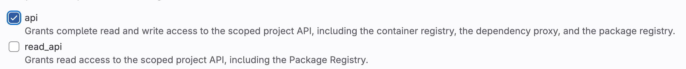
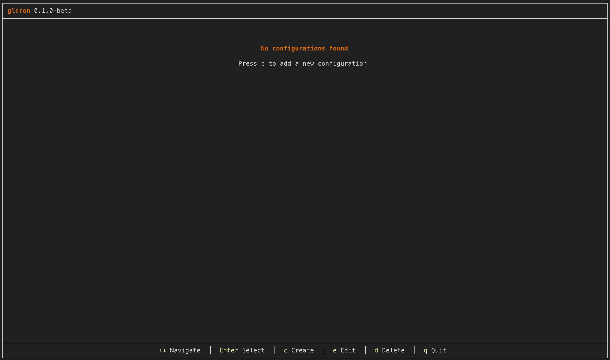
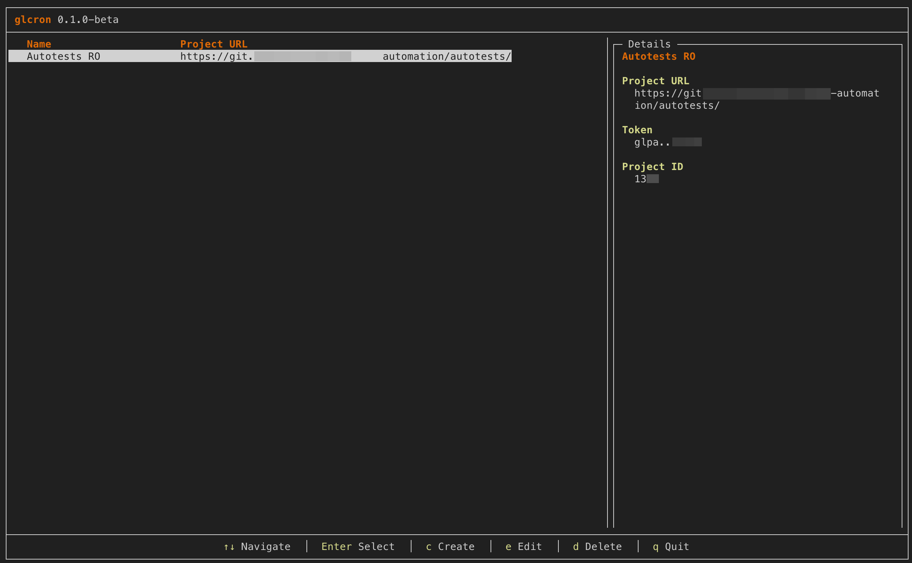
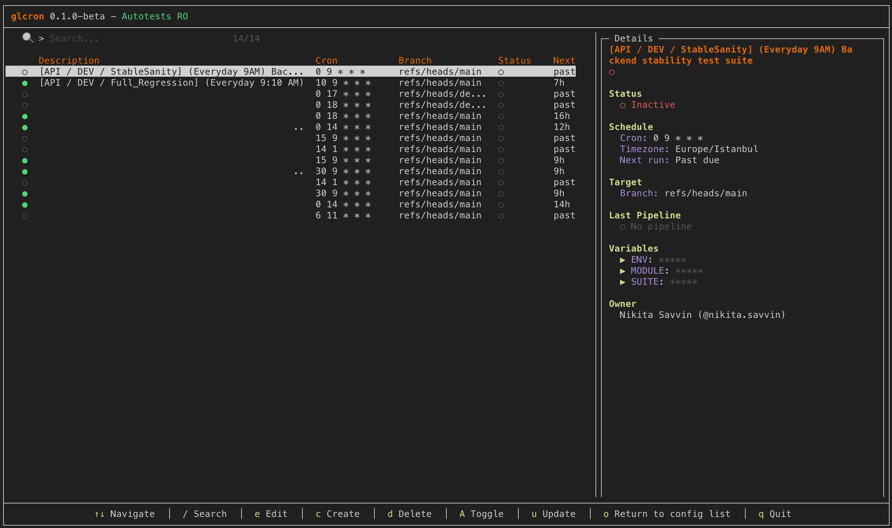
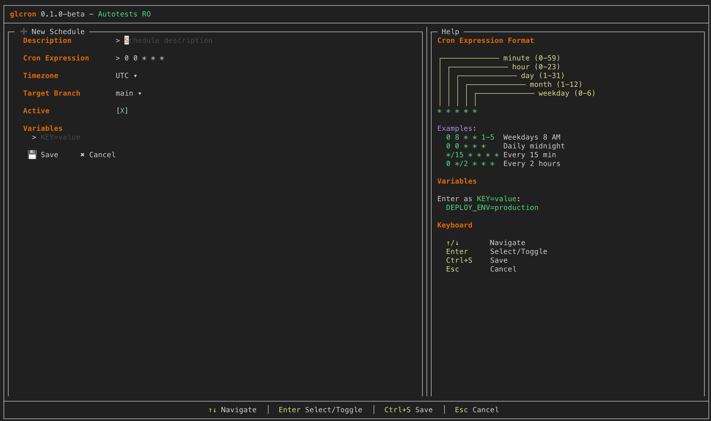
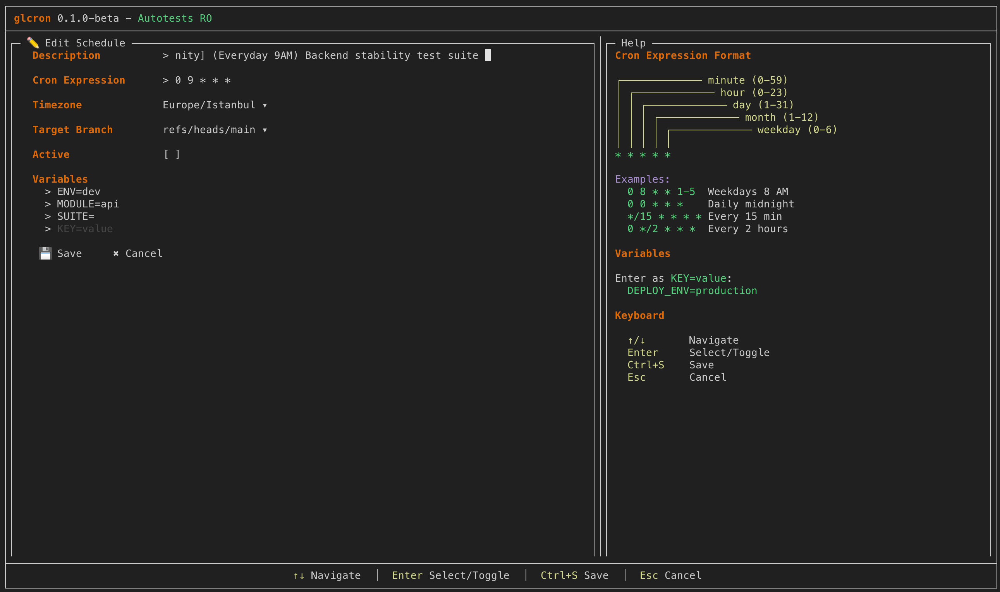

<p align="center">
  
</p>

<h1 align="center">glcron</h1>

<p align="center">
  <strong>A modern TUI for managing GitLab Pipeline Schedules</strong>
</p>

<p align="center">
  <a href="https://github.com/nikitasova/glcron/releases"></a>
  <a href="https://github.com/nikitasova/glcron/blob/main/LICENSE"></a>
  <a href="https://github.com/nikitasova/glcron/stargazers"></a>
  <a href="https://github.com/nikitasova/glcron/network/members"></a>
  
</p>

<p align="center">
  <a href="#-features">Features</a> •
  <a href="#-installation">Installation</a> •
  <a href="#-quick-start">Quick Start</a>
</p>

> 🚧 **Project under development...**


## ✨ Features

| Feature | Description |
|---------|-------------|
| 📋 **Multi-Project Support** | Manage pipeline schedules across multiple GitLab projects |
| 🔄 **Full CRUD Operations** | Create, read, update, and delete pipeline schedules |
| 🎯 **Vim-Style Navigation** | Navigate with `j`/`k` or arrow keys |
| 🔍 **Search & Filter** | Quickly find schedules by description, branch, or cron |
| ⌨️ **Keyboard-Driven** | All operations via intuitive keyboard shortcuts |
| 🎨 **Beautiful TUI** | Modern terminal interface with colors and status indicators |
| 🔐 **Secure** | Tokens stored locally in `~/.config/glcron/` |
<!-- | 📊 **Pipeline Status** | View last pipeline status at a glance [under de] | -->


## 📊 Platform Support

| Platform | Support | Notes |
|----------|---------|-------|
| 🍎 **macOS** | ✅ Available | Homebrew (Intel & Apple Silicon) |
| 🐧 **Linux** | ✅ Available | Homebrew, DEB, RPM packages |

## 📦 Installation

### Homebrew (macOS/Linux)

```bash
brew install nikitasova/glcron/glcron
```

### Debian/Ubuntu (APT)

```bash
# Add GPG key
curl -fsSL https://nikitasova.github.io/glcron/repo/apt/glcron.gpg | sudo gpg --dearmor -o /usr/share/keyrings/glcron.gpg

# Add repository
echo "deb [signed-by=/usr/share/keyrings/glcron.gpg] https://nikitasova.github.io/glcron/repo/apt stable main" | sudo tee /etc/apt/sources.list.d/glcron.list

# Install
sudo apt update
sudo apt install glcron
```

### Fedora/RHEL (RPM)

```bash
# Download from GitHub releases
curl -LO https://github.com/nikitasova/glcron/releases/latest/download/glcron_0.1.0-beta_linux_amd64.rpm
sudo rpm -i glcron_*.rpm
```

### From Source 

```bash
# Clone the repository
git clone https://github.com/nikitasova/glcron.git
cd glcron

# Build
make build

# Or install to $GOPATH/bin
make install
```

---

## 🚀 Quick Start

<p align="center">
  
</p>
 
> Soon...

### 1. Run glcron

```bash
glcron
```

### 2. Add a GitLab Configuration

Press `c` to create a new configuration:
- **Name**: A friendly name (e.g., "My Project")
- **Project URL**: `https://gitlab.com/group/project`
- **Token**: Your GitLab Personal Access Token


### Creating a GitLab Token

1. Go to **GitLab** → **User Settings** → **Access Tokens**
2. Create a new token with `api` scope
3. Copy and use it when adding a configuration

> ❗ Note: You can create tokens with limited scopes, but `api` is required for full functionality. 



---

<p align="center"></p>

<p align="center"></p>

### 3. Manage Schedules

Select your configuration and start managing pipeline schedules!


## 📖 Usage

### Screenshots

<p align="center">
  <em>Configuration List</em><br>
  
</p>

<p align="center">
  <em>Schedule List</em><br>
  
</p>

<p align="center">
  <em>Create Schedule</em><br>
  
</p>

<p align="center">
  <em>Edit Schedule</em><br>
  
</p>


### Keyboard Shortcuts

#### Configuration Screen

| Key | Action |
|-----|--------|
| `↑`/`↓` or `j`/`k` | Navigate |
| `Enter` | Select configuration |
| `c` | Create new configuration |
| `e` | Edit configuration |
| `d` | Delete configuration |
| `q` | Quit |

#### Schedule List Screen

| Key | Action |
|-----|--------|
| `↑`/`↓` or `j`/`k` | Navigate |
| `/` | Search schedules |
| `c` | Create new schedule |
| `e` or `Enter` | Edit schedule |
| `d` | Delete schedule |
| `A` | Toggle active/inactive |
| `u` | Refresh from GitLab |
| `o` | Return to configurations |
| `q` | Quit |

#### Edit Schedule Screen

| Key | Action |
|-----|--------|
| `Tab` / `Shift+Tab` | Next/Previous field |
| `Enter` | Select dropdown / Toggle checkbox |
| `Ctrl+S` | Save schedule |
| `Esc` | Cancel |


## ⚙️ Configuration

> glcron stores configuration in `~/.config/glcron/glcron.json`.

You can also manually edit the configuration file:

```json
{
    "configs": [
      {
        "name": "Test-1",
        "project_url": "https://yourgitlab.com/yourgroup/yourproject-1",
        "token": "token-1234567890abcdef",
        "project_id": 1,
        "base_url": "https://yourgitlab.com"
      },
      {
        "name": "Test-2",
        "project_url": "https://yourgitlab.com/yourgroup/yourproject-2",
        "token": "token-1234567890abcdef",
        "project_id": 2,
        "base_url": "https://yourgitlab.com"
      }
    ]
  }
```


## 🛠️ Development

```bash
# Run in development mode
make dev

# Build binary
make build

# Run tests
make test

# Format code
make fmt

# Build for all platforms
make build-all
```


## 📋 Requirements

- Go 1.22+
- Terminal with color support


## 🤝 Contributing

Contributions are welcome! Please feel free to submit a Pull Request.

1. 🍴 Fork the project
2. 🔨 Create your feature branch (`git checkout -b feat/amazing-feature`)
3. 📝 Commit your changes using [Conventional Commits](https://www.conventionalcommits.org/)
4. 🧪 Run tests and linters (`make test quality-local`)
5. 🚀 Push to the branch (`git push origin feat/amazing-feature`)
6. 📬 Open a Pull Request


## 📄 License

This project is licensed under the MIT License - see [LICENSE](LICENSE) for details.


## ❤️‍🔥 Support

- ⭐ [Star the project](https://github.com/nikitasova/glcron)
- 🐛 [Report a bug](https://github.com/nikitasova/glcron/issues/new?labels=bug)
- 💡 [Request a feature](https://github.com/nikitasova/glcron/issues/new?labels=enhancement)
- 📣 Share the project with your friends

Thank you for your interrest ! 😊